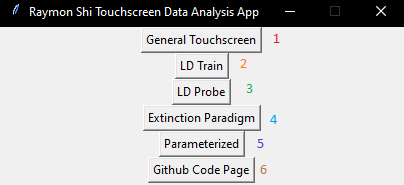
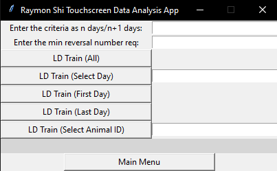
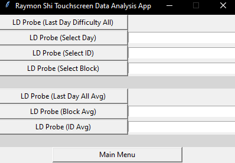
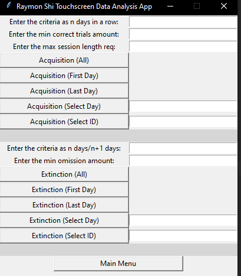
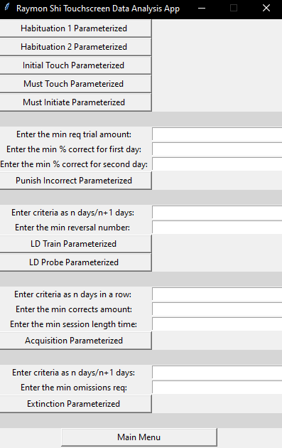

# Eisch Lab - Touchscreen Data Analysis App

The EL Touchscreen Data Analysis App takes in complex raw ABET data and returns a csv file with usable data ready to be used for graphing mice performance over the span of the experiment.

This application can be used for the following test:
* Habituation 1 and 2
* Initial Touch
* Must Touch
* Must Initiate
* Punish Incorrect
* Location Discrimination Train
* Location Discrimination Probe
* Acquisition
* Extinction

## Some Pictures of the Application
 

  
 

## Modules
  ```
  pandas
  numpy
  tkinter
  os
  glob
  xlsxwriter
  webbrowser
  warnings
  ```
 
 ## Installation
  ```
  pip install pandas
  pip install xlsxwriter
  pip install webbrowser
  ```
  
 ## Files
 ### ts_main.py
 ```
 The main file that gets ran. Calls on the other files and creates all of the GUI using tkinter.
 ```
 
 ### setup.py
 ```
 This file is used to determine which test should be ran and parses the raw ABET data accordingly. It also creates
 the merged_files.csv and the dropped_duplicates.csv, both of which are useful for debugging.
 ```
 
 ### setup_functions.py
 ```
 This file contains extra functions that are used to help the setup.py parse the raw ABET data.
 ```
 
 ### general_touchscreen.py
 ```
 This file contains all the functions that are used to do all the General Touchscreen functions.
 ```
 
 ### ld_train.py
 ```
 This file contains all the functions that are used to do all the Location Discrimination Train functions.
 ```
 
 ### ld_probe.py
 ```
 This file contains all the functions that are used to do all the Location Discrimination Probe functions.
 ```
 
 ### acquisition_extinction.py
 ```
 This file contains all the functions that are used to do all the Acquisition and Extinction functions.
 ```
 
 ### parameterized.py
 ```
 This file contains all the functions that are used to do all the Parameterized functions.
 ```
 
 ## Usage
 ```
 python ts_main.py
 
 Navigate to which test you want cleaned data for.
 Click on the specific button to perform a specific type of cleaning.
 Navigate to the directory where the raw data is stored and hit select folder.
 Wait a few moments.
 Navigate to the directory where you want to store the newly created csv file and name it.
 Go to the directory where you saved the file and open it.
 Use the file to start graphing mice performance over the course of the experiment.
 ```
 
 ## License
 ```
 Feel free to use it, but please credit me :)
 ``` 
 
 ## Contact Me
 ```
 If you have questions, you can email me at raymons@sas.upenn.edu
 ```
 
